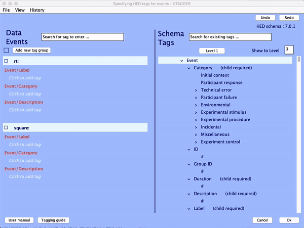
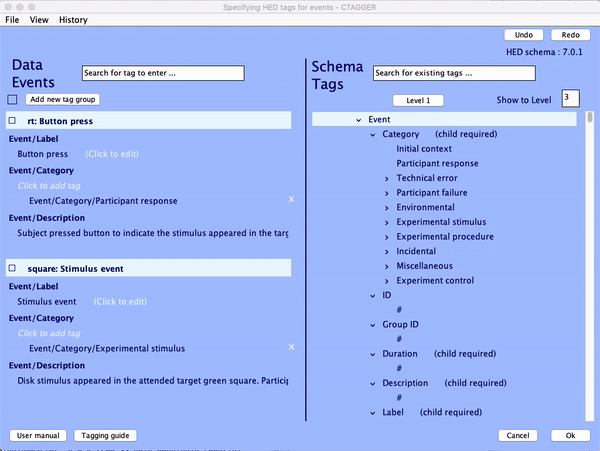
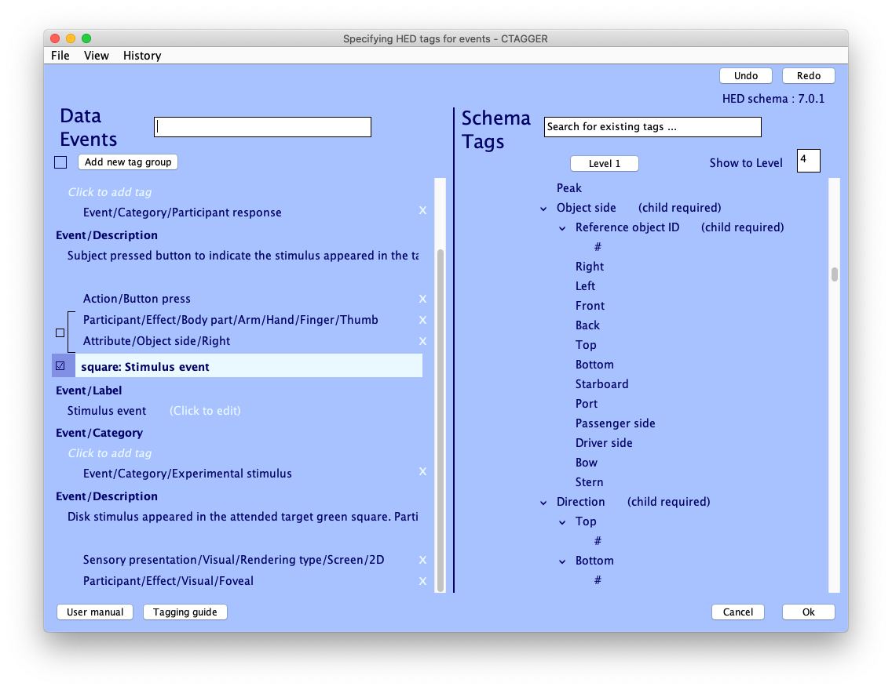
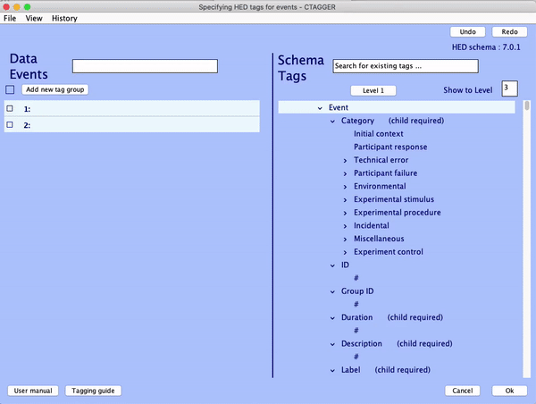
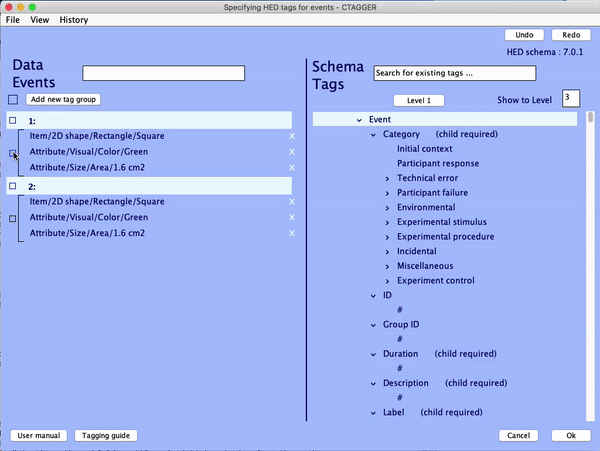

**Events Should Have HED Tags**: ("What does '*Event code 17*' mean?") Traditionally, software systems for event-related EEG data collection and analysis have used simple numeric codes (like 17, 129, etc.) whose meaning is hopefully saved with the data somewhere. Else event types are each given a brief text label ('*Target*'). But with the creation and availability of new analysis methods for extracting information, EEG data are valuable long after their first publication, and will in near future become even more so as public *data, tool, and compute resources (DATCORs)* housed on available clouds or high-perrormance (super) computer networks become active and available. Archiving data in private or public DATCORs allows further and/or intensive data analyses, as well as meta-analyses across studies having different designs. All of this requires that the more exact natures of the recorded experimental events are saved and accessible in an agreed upon format. Today the *only* such format is the **Hierarchical Event Descriptor (HED)** system of Nima Bigdely-Shamlo, Kay Robbins, et al., first developed at the Swartz Center, UCSD (REF). Accordingly, the HED standard has been accepted in the rapidly emerging BIDS standards for archiving human brain imaging data of all types. In conjunction with a project to build a DATCOR ('NEMAR') for human neuroelectromagnetic data under NIMH funding, we (Scott Makeig, Arno Delorme, Amit Majumdar, Russ Poldrack) and  colleagues are creating and polishing tools 1) to make adding the more detailed HED tag descriptions of experimental events to new or existing data sets as simple as possible, and 2) to use HED tags within the EEGLAB signal processing environment for eelctrophysiological data (sccn.ucsd.edu/eeglab) to build custom collections of event-related data epochs based on details of the HED event descriptions (for example, to gather a collection of event-related data epochs time locked to screen presentations of green versus red visual stimuli from a set of archived HED-tagged EEG studies). The HED team is now working to put enhanced HED tutorial websites and videos online.

**HED Tagging**: Most people who have worked with EEG data are familiar with the practice of using brief, vaue, and lab- or study-specific labels (*'Target'*) or arbitrary integers (*'event type 17'*) to record the nature of experimental events occurring during an EEG, MEG, or iEEG experiment. Re-using such a collected dataset for new analysis thus involves first locating and reading the reported experiment description carefully to gain a more detailed sense of the meaning of the saved event codes or labels. However, the lack of detail in stored numeric event codes and event labels prevents researchers from flexibly combining events across studies based on the precise nature of the experimental events (questions such as: *'Are green stimuli processed differently than red, no matter their shape?'*, *'Is there any EEG biomarker of the participant having heard a natural sound (such as a bird call) rather than a synthetic sounded (such as a sine tone)?'*). Nor are researchers able to most efficiently evaluate which events to include in their analyses (e.g. to fulfill goals such as, *'Only the blue targets'.*). Meanwhile, the increasing momentum and success of various data sharing efforts now begin to allow EEG researchers to access an increasing number of datasets from many studies involving different designs. This opens the possibility of applying advanced machine learning algorithms to analyze EEG dynamics based on a larger and more diverse scale of data. Unfortunately, it would be infeasible to actualize these possibilities, given the constraints imposed by hereto current practice in experimental event annotation.

**The HED System**:The *Hierarchical Event Descriptor (HED)* system provides a standardized way to describe more precisely the nature of recorded or later identified experimental events. Using HED-tagged datasets, researchers no longer have to deal with stored, meaningless event codes or vague text labels. Moreover, HED-informed analysis tools are able to aggregate events *across* any number of archived studies, with minimal human supervision. The HED system comprises a schema (syntax and agreed upon top-level tag hierarchy) and a software ecosystem supporting annotation, validation, and extraction of EEG events using HED tags. The [*HED schema*](http://www.hedtags.org/display_hed.html) specifies a collection of HED tags in use to annotate events, organized in a partially hierarchical structure. Software supporting the use of HED event tagging currently includes the EEGLAB plug-in [*HEDTools*](https://github.com/hed-standard/hed-matlab/tree/master/EEGLABPlugin), the GUI-based tagging program [*CTAGGER*](https://github.com/hed-standard/hed-java/blob/master/java/tagging/CTagger.jar) (now bundled with the *HEDTools* plug-in), and the online [*HED validator*](http://visual.cs.utsa.edu/hed/validation).

**Using HED and HEDTools**: This guide will focus on the EEGLAB plug-in *HEDTools* for experimental event annotation, validation, and identification using  HED event tags. After reading this guide, you will be familiar with the HED Schema and how to associate HED tags with events in existing data, either manually or using the *ctagger* tool. You will also see how to use HED-annotated event descriptions in your analysis. Your understanding will not be limited to working in the EEGLAB environment; the HED system can be used in any data analysis tool environment.

[I. Event annotation & extraction with EEGLAB plug-in *HEDTools*](#I)

1. [What is EEGLAB?](#I.1)
2. [Installing EEGLAB and load dataset](#I.2)
3. [Adding tags using CTAGGER](#I.3)
4. [Validating tagged dataset](#I.4)
5. [Extracting HED-annotated events](#I.5)

[II. HED schema and the art of tagging](#II)

## <a name="I">I. Event annotation & extraction with EEGLAB plug-in *HEDTools*</a>
#### <a name="I.1">1. What is EEGLAB? Setting up the plug-in</a> 

[EEGLAB](https://sccn.ucsd.edu/eeglab/index.php) is the most widely used EEG software environment for analysis of human electrophsyioloigcal (and related) data. It combines graphical and command-line user interfaces, making it friendly for both beginners who may who prefer a more flexible, visual, and automated way of analyzing data, and experts, who can easily extend the EEGLAB tool environment by writing new EEGLAB compatible functions and/or publishing EEGLAB plug-in toolboxes that are then immediately available, through the EEGLAB graphic user interface (GUI) to anyone who downloads them.

The plug-in *HEDTools* for EEGLAB can be installed using one of the following ways:

1. From the EEGLAB Plug-in Manager: Launch EEGLAB and go to **File -> Manage EEGLAB extension**. The plug-in manager GUI will pop up. From this GUI look for and select the plug-in *HEDTools* from the main window, then click into the *Install/Update* button to install the plug-in.
2. From the web: Download the zip file with the content of the plug-in *HEDTools* either from [GitHub](https://github.com/hed-standard/hed-matlab/blob/master/EEGLABPlugin/HEDTools2.5.0.zip) or from the EEGLAB [plug-ins summary page](https://sccn.ucsd.edu/eeglab/plugin_uploader/plugin_list_all.php). Decompress the zip file into the folder *../eeglab/plugins* and restart EEGLAB.

#### <a name="I.2">2. Load dataset and start tagging</a>

In this quick guide, we will first use the simple EEGLAB tutorial dataset, which you can download [here](https://sccn.ucsd.edu/mediawiki/images/9/ simple9c/Eeglab_data.set). Once you have opened the EEGLAB main window, load the dataset by selecting the **File > Load existing dataset** menu item, then selecting the tutorial dataset you just downloaded. 

Read a description of the dataset and of its included event codes by selecting **Edit -> About this dataset**:

Our goal is to use HED tags to describe the experimental events recorded in the *EEG.event* data structure, so that anyone who will reuse the dataset in the future will not need to read a separate, detailed description of the dataset or study to (hopefully) understand the exact nature of the recorded experimental events

#### <a name="I.4">3. Adding tags using CTAGGER</a>

From EEGLAB menu, select **Edit -> Add/Edit event HED tags**, which will bring up a text etnry window allowing you to specify options for tagging:

Here we will proceed using the default options, which use the latest version of the official HED schema. We will also assume that you are tagging the dataset for the first time and not re-using any previous tagging scheme. Here, we will use *CTAGGER* and its event field selector panel for tagging (as detailed below). Hit **Ok** to continue.

A window will pop up to let you choose which event field to use for tagging:

Fields listed in the select box are extracted from the *EEG.event* fields, ignoring other EEG structure fields (*.latency, .epoch, and .urevent). *Primary field* is the field used to specify the type of the event; the other fields are subfields used to specify conditions or subcategories within the event. In most EEGLAB dataset structures, *EEG.event.type* is the primary field and the first field we want to tag. Select "*type*" in the select box and click **Tag** which will open up *CTAGGER*:

CTAGGER (for 'Community Tagger') is an application written in Java to faciliate the process of adding HED tags to recorded events in existing datasets. Through its GUI, users can explore the HED schema, quickly look up and add tags (or tag groups) to the desired event codes, and use import/export features to reuse tags on other datasets (e.g., other datasets from the same study).

On the left side, the **Data Events** panel containins values of the selected event field and their associated tags. The right panel **Schema Tags** contains all available tags organized defined in the HED schema hierarchy. The process of tagging is then to simply choose tags from the schema to associate with each event code. The search bar in the **Schema Tags** panel can be used to look up a tag and see its position in the HED schema. Users can also use the search bar in the **Data Events** panel to quickly look up and directly add a tag to the selected event value. 

First we will add a short label and a detailed description to the event codes using tag *Event/Label* and *Event/Description*. These tags are meant for human readability and will be ignored during machine processing. A restriction in HED tags is that tag values must not contain a comma (a common mistake in beginner event descriptions). Next, we want to generally categorize these events using tag *Event/Category*.  We will use the tag *Event/Category/Experimental stimulus* for stimulus presentation events (here, "*square*" events) and  *Event/Category/Participant response* for participant response events (here, "*rt*" events). 

With this information, the dataset can now be shared; any researcher who uses the dataset can understand, quickly and easily, the more detailed natures of the recorded events. HED allows you to detail the nature of the events to any (hopefully, fine) level of description, so that analysis tools can then automatically aggregrate events using tags with minimal human supervision. So let's keep tagging!

Let us begin with the *partcipant response* events. We denote the type of action participant performed using *Action/* tags. as in this experiment the subject was asked to press a button as quickly as possible whenever they saw a '*target*' stimulus, we use *Action/Button press* to describe the basic nature of the event. In this case the subject was asked to use their right thumb to press the button. To record this fact in the HED tag, we first add a tag group ??? to "*rt*" ???. A tag group contains a main tag plus *Attribute/* tags that describe the main tag. Searching for keyword "*thumb*" in the ??????? returns *Participant/Effect/Body part/Arm/Hand/Finger/Thumb*. We add this tag to the group. Searching for "*right*" returns multiple results -- here we care only about those with *Attribute* prefixes. *Attribute/Object side/Right* seems the most likely tag to use in this case. Clicking on the tag brings us to the location of the tag in the HED schema. Hovering the mouse cursor over "*Object side*" shows a tag description in a floating tooltip: "*Could be the left, right, or both sides of a person or a vehicle*", confirming our presumption. So we add the tag to the tag group, completing the HEDtag description of the participant response ("*rt*") events.

???NEED TO REFER TO THE FIXATION CROSS -- AND ITS IMPERATIVE EFFECT: 'RETAIN FIXATION HERE'.???
???NEED TO DESCRIBE THAT THE FIVE (HOLLOW) BOXES REAMIN ON THE SCREEN DURING TASK BOUTS???

Next, we describe the recorded stimulus presentation events. We record how the sensory stimulus was presented to the participant using a *Sensory presentation/* tag. In this case visual stimuli were presented on a (2D) computer screen, so we use *Sensory presentation/Visual/Rendering type/Screen/2D*. We also want to describe the intended effect of the stimuli on the participant using *Participant/* tags. Since subjects were asked to explicitly pay attention to presentations of target squares, with time pressure to make a quick button press response, we use tags *Participant/State/Attention/Covert* and *Participant/State/Under time pressure*. At this point the *CTAGGER* window should look like this:

We also want to describe the nature of the presented stimulus itself. In this study, the stimulus is a filled circular disk appearing randomly in one of five green-outlined squares spaced evenly on a horizontal plane above the center fixation cross. The tutorial sample dataset only includes event-related epochs in which the disk appeared in the two left-most squares, annotated by event field *"position
"*. To include screen position information in the stimulus description, we will use tag field *"position"*. As we have finished tagging the field *"type"*, press **Ok** in the current *CTAGGER* window. The field selection window becomes active again; this time we choose *"position"* before pressing **Tag**. The *CTAGGER* window will appear again, this time with *"position"* event values *"1"* or *"2"*, indicating that the stimulus appeared within squares centered, respectively, about 5.5 degrees and 2.7 degrees of horizontal visual angle from screen center.

The presented stimuli are circular disks appearing within green squares; so we use two groups to describe them separately. We first describe the bounding square. Click on the checkbox next to button *"Add new tag group"* to select ???both values???, and then click ???the button??? to add ???a group??? to both of them. Select the two newly added groups. We use tag */Item/2D shape/Rectangle/Square* and */Attribute/Visual/Color/Green* to describe the green square. ???WHAT ABOUT 'EMPTY'??? We can also denote the area of the square using tag */Attribute/Size/Area*. Clicking on the tag will pop up a window prompting for a value. We enter "1.6" as the value and select "cm2" as the unit, rendering a complete tag */Attribute/Size/Area/1.6 cm2*. ???SHOULD ALSO BE VISUAL ANGLE???

We should also include information about the positions of the presented stimuli on the screen. For events with position value "1", we add tags *Attribute/Location/Screen/Center displacement/Horizontal/2.7 degrees* and *Attribute/Location/Screen/Center displacement/Vertical/1.8 degrees* to describe their horizontal and vertical visual angle disparity from screen center, respectively. For eventw with position value "2", we add *Attribute/Location/Screen/Center displacement/Horizontal/5.5 degrees* and *Attribute/Location/Screen/Center displacement/Vertical/1.8 degrees*. We have now described the green square stimulus presentation events.

We add a second group to describe the presented circular disk. Similar to tagging the square, we add tags */Item/2D shape/Ellipse/Circle*, */Attribute/Visual/Color/Black*, and */Attribute/Size/Area/1.4 cm2* to describe the disk and  *Attribute/Location/Screen/Center displacement* tags to describe its position accordingly.

Click **Ok** on CTAGGER window and **Ok** on the field selection window. A window will pop up asking if you want to save the **field map**. Field map is the mapping between all event codes and their associated HED tags that we just added. If saved, you can re-import it to another dataset with similar event codes. Click **Ok** when you're done. 

A last window will pop up asking what you would like to do to the newly tagged dataset and the old, untagged, dataset. You can choose to overwrite the old dataset with the tagged one or save new dataset as a separate file. Click **Ok** when you're done. 

You just finished tagging! *HEDTools* generates the final HED string for each event by concatenating all tags associated with the event values of that event, seperated by commas, and put the string in a new field **usertags**. You can check this by opening up EEG.event in MATLAB variable window:

#### <a name="I.4">4. Validating a HED-tagged dataset</a>

#### <a name="I.5">5. Extracting HED-tagged events and event-locked data epochs from an EEGLAB dataset</a>

## <a name="II">II. The HED schema and the art of event annotation</a>

